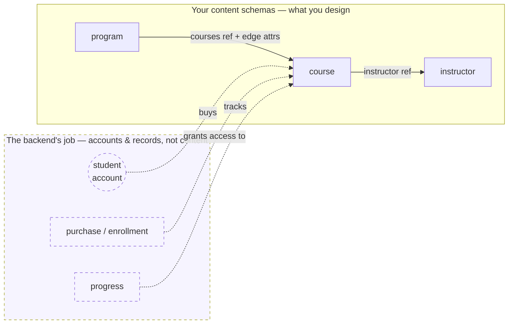

# Designing Data Schemas

A **data schema** defines a *content type* — the shape of a thing your project is about. A course. A lesson. An instructor. You write the schema once, and it drives validation, the editor's forms, and how records reach your components.

This guide is about the **design decisions** you make when you model a set of related types — how to group fields, when to nest, when to connect one type to another, and — just as important — **what doesn't belong in a content schema at all**. It runs on one example throughout: the content model behind a **course platform**.

> **Sites *and* app-based solutions — one data model.** The `uniweb` CLI builds more than static sites. A uniweb project can be a **content-driven site** (file-backed, prerendered, no server) or an **app-based solution** — the same site backed by its own **backend**: a database, user accounts, commerce, and your data schemas served dynamically. The backend is **optional**, and it doesn't change how you *design* your data. The schemas in this guide are the data model either way; the backend is what gives them users, access control, and persistence. Where that line falls is [its own section below](#content-vs-the-backend).

For the field-by-field syntax (types, `format`, `localized`, namespaces), see [Data Schemas](./data-schemas.md). For how a record is written out, see [Entity Content Structure](../reference/entity-content.md). For how records reach your components at runtime, see [Working with Data](./working-with-data.md).

---

## Start by naming the types

Before writing any fields, list the **things** your domain is about. For a course platform, the *content* is:

- **course** — a unit of learning
- **lesson** — a single teachable piece (sometimes part of a course, sometimes reusable)
- **instructor** — the person who teaches, as a public profile
- **program** — a curriculum made of several courses

Each becomes a schema. The interesting part isn't the fields inside each one — it's how they relate. That's what the rest of this guide is about.

> **Notice who's *not* on that list.** A course platform obviously has **students**, **enrollments**, and **purchases** — and none of them are content types. A student is a *user account*; an enrollment is a record the *backend* writes when someone buys. They aren't data you author. Knowing what to leave out is half of good schema design — we come back to it in [Content vs. the backend](#content-vs-the-backend).

> Reuse before inventing: the standards (`@std/person`, `@std/event`, …) already cover common shapes. An instructor profile is just a person — reach for `@std/person` rather than rolling your own. This guide writes its own `@/…` types to stay self-contained, but a real project leans on `@std/*` wherever one fits.

---

## Sections: group fields into named parts

The simplest schema is a flat list of fields — one record's worth of data:

```yaml
name: lesson
fields:
  title:   { type: string, required: true }
  body:    { type: text, format: markdown }
  minutes: { type: int }
```

When a type has **distinct groups** of fields, or **repeating** data, you organize them into named **sections**. A section is a namespace for a group of fields, with a *kind*:

- **`single`** — one record (an object).
- **`multi`** — a repeating list of records (an array).

A type can have **several** sections. Use multiple `single` sections to keep distinct concerns apart; use `multi` sections for "many of something." Mark one `single` section **`brief: true`** — the type's lean summary: its title and the few fields that identify it. The brief is the type's stand-in wherever it's shown in short form (in a reference from another type, a card, a search result), so keep it to the essentials.

```yaml
name: course
sections:
  identity:                 # the brief — what the course is
    kind: single
    brief: true
    fields:
      title:   { type: string, required: true }
      summary: { type: text, format: markdown }
      level:   { type: string, enum: [intro, intermediate, advanced] }
  details:                  # a second single section — a separate concern
    kind: single
    fields:
      credits: { type: int }
      weeks:   { type: int }
```

> **Field or section?** A **field** holds one value, or a simple list (`{ type: array, items: { type: string } }`). A **section** holds a whole record, or many records. Reach for a section when the group has its own structure — multiple fields, repetition, or nesting; keep it a field when it's a single value or a flat list.

---

## Subsections: model hierarchy

A section can contain **child sections** — a section nested inside another, with its own fields. This is how you model **hierarchy**: a course has modules, and each module has lessons.

```yaml
name: course
sections:
  identity:
    kind: single
    brief: true
    fields:
      title: { type: string, required: true }

  modules:                  # many modules per course
    kind: multi
    fields:
      title: { type: string }
    sections:
      lessons:              # many lessons per module
        kind: multi
        fields:
          title: { type: string }
          body:  { type: text, format: markdown }
```

(A section can hold both its own `fields` *and* child `sections`, as `modules` does here.) A record nests the same way: each module is a record with a `lessons` array inside it (see [Entity Content Structure](../reference/entity-content.md)). The hierarchy is **pure structure** — no IDs to wire up, no back-pointers; the data tree mirrors the schema tree.

Subsections are the right tool when the nested data is **owned by** and **local to** its parent — modules and lessons only exist *inside* their course. When that's not true, you reach for a reference instead.

---

## Embed or reference?

This is the central modeling decision. You have a second type — say `instructor` — and another type needs to point at it. Two options:

**Embed** — put the fields directly inside, as a subsection. The data lives in the parent and belongs to it.

**Reference** — store a pointer to a separate record with a **`ref`** field (a *relation*, in database terms):

```yaml
instructor: { type: ref, ref: '@/person' }   # points at a separate person record
```

A `ref` field stores a pointer to a record of another type, by its slug — the two records stay separate. Choose between embed and reference by asking **"does this thing exist on its own?"**

| Embed (subsection) | Reference (`ref`) |
|---|---|
| Owned by one parent | Exists independently |
| No meaning outside it | Reused across parents |
| Lives and dies with its parent | Outlives any one parent |
| Lessons within a course | An instructor who teaches several courses |

> **The lesson question.** Are lessons *part of* one course (embed them as a subsection), or are they a **reusable** type that several courses include (make `lesson` its own schema and reference it)? Both are valid — the answer is about your domain, not the framework. Make `lesson` standalone when lessons are reused or managed on their own; embed them when they're just the structure of one course.

---

## Relationships with attributes: edge attributes

Sometimes the **relationship itself** has data — facts that belong to neither end alone. A program includes a course *as required or elective, in a particular order*. "Required" isn't a property of the program, nor of the course — it's a property of **the link between them**.

Model this as a **`multi` section whose items carry a `ref` plus sibling fields**. The reference names the other end; the sibling fields are the **edge attributes** — the relationship's own data (the columns you'd put on a join table, if you think in SQL):

```yaml
name: program
sections:
  identity:
    kind: single
    brief: true
    fields:
      title: { type: string, required: true }

  courses:                  # the program's courses, each link carrying its own data
    kind: multi
    fields:
      course:      { type: ref, ref: '@/course' }                 # the reference
      requirement: { type: string, enum: [required, elective] }   # edge attribute
      order:       { type: int }                                   # edge attribute
```

Here the edge attributes live **inside a parent** (`program`), because the relationship clearly belongs to the program's side. That's the common case for a content-to-content join.

### When the relationship is its own type

Sometimes a relationship is important enough to be a **type in its own right** — it has its own attributes and you query it directly. The textbook LMS example is **enrollment**: a student takes a course, with an enrollment date and a grade.

```yaml
name: enrollment
fields:
  student:     { type: ref, ref: '@/person' }   # one end
  course:      { type: ref, ref: '@/course' }   # the other end
  enrolled_on: { type: date }                    # edge attribute
  grade:       { type: string, enum: [A, B, C, D, F, incomplete] }
  status:      { type: string, enum: [active, completed, withdrawn] }
```

Structurally this is a perfect standalone relationship type — two references plus data on the link — and for a **content-to-content** join, it's exactly the right shape. But look closely at *this* one: **the `student` end isn't content.** A student is a person who logs in and pays. That single fact moves `enrollment` out of your content schemas entirely — and it's the cleanest illustration of the most important line in schema design, so it gets its own section next.

---

## The three shapes of "many"

When one type relates to *many* of another, pick the shape by how much the **link** carries:

| Shape | Looks like | Use when |
|---|---|---|
| **Embedded subsection** | a `multi` section with full fields | the children are owned and local (a course's modules) |
| **List of references** | `{ type: array, items: { type: ref, ref: '@/course' } }` | you only need pointers, no per-link data (a course's prerequisites) |
| **References with edge attributes** | a `multi` section of `{ ref + sibling fields }` | the connection itself has data (a program's courses) |

The question is always *how much does the link carry* — nothing (a bare list of refs), its own attributes (a multi section of ref + fields), or it's really an owned child (embed it).

---

## Content vs. the backend

The sharpest question in schema design isn't *how* to model something — it's **whether it's content at all.** A content schema models **what your project is about.** It does **not** model **who uses your project**, or **what they've done.**

Three things a course platform clearly needs, none of them content:

| Not content | What it actually is |
|---|---|
| **Student** | a **user account** — an identity that logs in, whose credentials the backend holds |
| **Enrollment / purchase** | a **record the backend writes** when someone buys or signs up — not authored |
| **Progress, completion, quiz scores** | **what a person *did*** — activity, not authored content *(storing it is the app's job; nothing tracks it for you)* |

The tell is always the same: **if a record is about a *person who logs in*, or about *something they did*, it isn't content.** An instructor *bio* is content — you author it, it renders on the course page. The instructor's *login* is an account. Same human, two different things, in two different layers. Don't model the account as content, and don't try to author the enrollment.

**This is where the optional backend comes in.** A static uniweb site has no users and no database, so this layer simply doesn't exist — you ship content, visitors read it. Turn the project into an **app-based solution** and it gains a **backend**: user accounts and authentication, **commerce** (checkout, subscriptions), and a database that **serves your data schemas dynamically** instead of from files. Crucially, the backend doesn't ask you to redesign anything — **the same `@/course`, `@/lesson`, `@/program` schemas you design here are what it stores and serves.** What the backend *adds* is precisely the layer that isn't content: the accounts, the purchases, the access control, the per-user records. You design the content; the backend gives it users and memory.

So the boundary is a feature, not a limitation. Keep your schemas about the domain — courses, lessons, instructors, programs — and let the backend own identity and transactions. The two stay cleanly separated, which is exactly why the **same content** can move from a static brochure site to a full course platform without reshaping a single schema.

---

## Worked example: the course-platform content graph

Four content types and the references between them — and, set apart, the things the backend owns rather than your schemas:



*Solid arrows are references between content types. `course` also **embeds** its modules and lessons (owned, so not a link) and carries a `prerequisites` list of `course` references. The dashed cluster is what an app-based solution's backend manages — accounts and per-user records — never authored as content.*

```yaml
# @/person — an independent type (the instructor's public profile; use @std/person in practice)
name: person
fields:
  name:  { type: string, required: true }
  email: { type: string, format: email }
  bio:   { type: text, format: markdown }
```

```yaml
# @/course — namespaces its own fields, embeds what it owns, references what it doesn't
name: course
sections:
  identity:                                                                    # the brief
    kind: single
    brief: true
    fields:
      title:   { type: string, required: true }
      summary: { type: text, format: markdown }
      level:   { type: string, enum: [intro, intermediate, advanced] }
  details:                                                                     # a separate concern
    kind: single
    fields:
      credits:       { type: int }
      weeks:         { type: int }
      instructor:    { type: ref, ref: '@/person' }                          # one reference
      prerequisites: { type: array, items: { type: ref, ref: '@/course' } }  # a list of references
  modules:                                                                     # embedded: owned by this course
    kind: multi
    fields:
      title: { type: string }
    sections:
      lessons:
        kind: multi
        fields:
          title: { type: string }
          body:  { type: text, format: markdown }
```

```yaml
# @/program — references courses, with edge attributes on each link
name: program
sections:
  identity:
    kind: single
    brief: true
    fields:
      title: { type: string, required: true }
  courses:
    kind: multi
    fields:
      course:      { type: ref, ref: '@/course' }
      requirement: { type: string, enum: [required, elective] }
      order:       { type: int }
```

The pattern: `person` is flat and independent; `course` **namespaces** its own fields into sections, **embeds** what it owns (modules, lessons), and **references** what it doesn't (instructor, prerequisite courses); `program` carries **edge attributes** on its links. Students, enrollments, and progress are nowhere in the schemas — they're the backend's, by design.

---

## From schema to a live experience

A schema isn't the destination — it's the contract that lets a **foundation** (the React component library that renders your content) turn records into pages. The last step is wiring data to components, and it reads the same whether or not you have a backend:

- **Content-driven site.** A page declares `data: courses`; the runtime delivers the collection as `content.data.courses` to a `CourseGrid`; a `[slug]/` template page delivers the focused record as `content.data.courses[0]` to a `CoursePage` or `LessonViewer`. No `fetch()`, no loading state — see [Working with Data](./working-with-data.md).
- **App-based solution.** The same components read the same `content.data.courses` — only now the backend serves it, gated by accounts and purchases. A well-built foundation lights up extra affordances when a backend is present (a price tag, an "enroll" button, a progress bar) and degrades gracefully to read-only content when it isn't.

The schema is the stable contract in the middle: design it once, and it drives validation, the editor's forms, runtime delivery, and — when you add a backend — dynamic serving and access control. Everything on either side can change; the content type stays put. ([Data Schemas as Contracts](../architecture/data-schemas-as-contracts.md) is the deeper *why*.)

---

## Rules of thumb

- **Default to a flat `fields:` schema.** Reach for sections only when you have repeating groups, hierarchy, or genuinely distinct namespaces.
- **Embed what's owned; reference what's independent.** "Does it exist on its own?" is the question.
- **If the link has data, it's an edge** — a `multi` section of `{ ref + fields }`, or a standalone relationship type.
- **Mark the brief.** One `single` section, `brief: true` — the type's at-a-glance summary; keep it lean.
- **Model what your project is *about*, not who *uses* it or what they've *done*.** People who log in are accounts; what they bought or completed are backend records — neither is a content schema.
- **Model the domain, not the storage.** The schema mirrors how you think about the things; let the framework (and the backend) handle the rest.

---

## See also

- [Data Schemas](./data-schemas.md) — the field-by-field authoring reference: types, `format`, `localized`, and the `@/` · `@std` · `@org` namespaces.
- [Working with Data](./working-with-data.md) — how a declared schema's records reach your components at runtime (collections, template pages, detail queries).
- [Entity Content Structure](../reference/entity-content.md) — how a record is written: sections become keys, subsections become inline fields.
- [Data Schemas as Contracts](../architecture/data-schemas-as-contracts.md) — why one schema serves validation, editor forms, and delivery at once.
</content>
</invoke>
