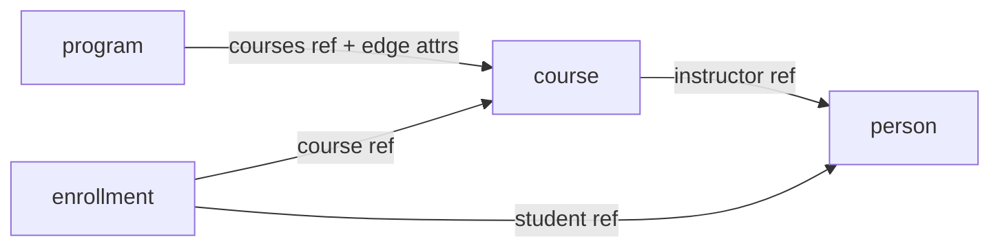

# Designing Data Schemas

A data schema defines an **entity type** — the shape of a thing your site is about. A course. A lesson. A person. You write the schema once, and it drives validation, the editor's forms, and how records reach your components.

This guide is about the **design decisions** you make when you model a set of related types — how to group fields, when to nest, and when to connect one type to another. It runs on a small **learning-management** example (people, courses, programs, enrollments) throughout.

For the field-by-field syntax (types, `format`, `localized`, namespaces), see [Data Schemas](./data-schemas.md). For how a record of a schema is written out, see [Entity Content Structure](../reference/entity-content.md).

---

## Start by naming the types

Before writing any fields, list the **things** your domain is about. For an LMS:

- **person** — an instructor or a student
- **course** — a unit of learning
- **program** — a curriculum made of courses
- **enrollment** — a student taking a course

Each becomes a schema. The interesting part isn't the fields inside each one — it's how they relate. That's what the rest of this guide is about.

> Reuse before inventing: the standards (`@std/person`, `@std/event`, …) already cover common shapes. This guide defines its own `@/person` to stay self-contained, but reach for a `@std/*` type when one fits.

---

## Sections: group fields into named parts

The simplest schema is a flat list of fields — one record's worth of data:

```yaml
name: lesson
fields:
  title:   { type: string, required: true }
  body:    { type: text, format: markdown }
  minutes: { type: int }
```

When a type has **distinct groups** of fields, or **repeating** data, you organize them into named **sections**. A section is a namespace for a group of fields, with a *kind*:

- **`single`** — one record (an object).
- **`multi`** — a repeating list of records (an array).

A type can have **several** sections. Use multiple `single` sections to keep distinct concerns apart; use `multi` sections for "many of something." Mark one `single` section **`brief: true`** — the type's lean summary: its title and the few fields that identify it. The brief is the type's stand-in wherever it's shown in short form (for example, in a reference from another type), so keep it to the essentials.

```yaml
name: course
sections:
  identity:                 # the brief — what the course is
    kind: single
    brief: true
    fields:
      title:   { type: string, required: true }
      summary: { type: text, format: markdown }
      level:   { type: string, enum: [intro, intermediate, advanced] }
  details:                  # a second single section — a separate concern
    kind: single
    fields:
      credits: { type: int }
      weeks:   { type: int }
```

> **Field or section?** A **field** holds one value, or a simple list (`{ type: array, items: { type: string } }`). A **section** holds a whole record, or many records. Reach for a section when the group has its own structure — multiple fields, repetition, or nesting; keep it a field when it's a single value or a flat list.

---

## Subsections: model hierarchy

A section can contain **child sections** — a section nested inside another, with its own fields. This is how you model **hierarchy**: a course has modules, and each module has lessons.

```yaml
name: course
sections:
  identity:
    kind: single
    brief: true
    fields:
      title: { type: string, required: true }

  modules:                  # many modules per course
    kind: multi
    fields:
      title: { type: string }
    sections:
      lessons:              # many lessons per module
        kind: multi
        fields:
          title: { type: string }
          body:  { type: text, format: markdown }
```

(A section can hold both its own `fields` *and* child `sections`, as `modules` does here.) A record nests the same way: each module is a record with a `lessons` array inside it (see [Entity Content Structure](../reference/entity-content.md)). The hierarchy is **pure structure** — no IDs to wire up, no back-pointers; the data tree mirrors the schema tree.

Subsections are the right tool when the nested data is **owned by** and **local to** its parent — modules and lessons only exist *inside* their course. When that's not true, you reach for a reference instead.

---

## Embed or reference?

This is the central modeling decision. You have a second type — say `person` — and another type needs to point at it. Two options:

**Embed** — put the fields directly inside, as a subsection. The data lives in the parent and belongs to it.

**Reference** — store a pointer to a separate record with a **`ref`** field:

```yaml
instructor: { type: ref, ref: '@/person' }   # points at a separate person record
```

A `ref` field stores a pointer to a record of another type, by its slug — the two records stay separate. Choose between embed and reference by asking **"does this thing exist on its own?"**

| Embed (subsection) | Reference (`ref`) |
|---|---|
| Owned by one parent | Exists independently |
| No meaning outside it | Reused across parents |
| Lives and dies with its parent | Outlives any one parent |
| Lessons within a course | An instructor who teaches several courses |

> **The lesson question.** Are lessons *part of* one course (embed them as a subsection), or are they a **reusable** type that several courses include (make `lesson` its own schema and reference it)? Both are valid — the answer is about your domain, not the framework. Make `lesson` standalone when lessons are reused or managed on their own; embed them when they're just the structure of one course.

---

## Relationships with attributes: edge attributes

Sometimes the **relationship itself** has data — facts that belong to neither end alone. A student "takes" a course *with a grade and an enrollment date*. The grade isn't a property of the student, nor of the course — it's a property of **the connection between them**.

Model this as a **`multi` section whose items carry a `ref` plus sibling fields**. The reference names the other end; the sibling fields are the **edge attributes** — the relationship's own data:

```yaml
name: enrollment
fields:
  student:     { type: ref, ref: '@/person' }   # one end
  course:      { type: ref, ref: '@/course' }   # the other end
  enrolled_on: { type: date }                    # edge attribute
  grade:       { type: string, enum: [A, B, C, D, F, incomplete] }  # edge attribute
  status:      { type: string, enum: [active, completed, withdrawn] }
```

Here `enrollment` is a type in its own right — the join between students and courses. Reach for a standalone relationship type when the connection is **first-class**: it has its own attributes, you query it directly, or it's a many-to-many with data on each link.

You can also attach edge attributes **inside** a parent, when the relationship clearly belongs to one side. A program's link to each of its courses carries data — is the course required, and in what order?

```yaml
name: program
sections:
  identity:
    kind: single
    brief: true
    fields:
      title: { type: string, required: true }

  courses:                  # the program's courses, each link carrying its own data
    kind: multi
    fields:
      course:      { type: ref, ref: '@/course' }                 # the reference
      requirement: { type: string, enum: [required, elective] }   # edge attribute
      order:       { type: int }                                   # edge attribute
```

---

## The three shapes of "many"

When one type relates to *many* of another, pick the shape by how much the **link** carries:

| Shape | Looks like | Use when |
|---|---|---|
| **Embedded subsection** | a `multi` section with full fields | the children are owned and local (a course's modules) |
| **List of references** | `{ type: array, items: { type: ref, ref: '@/course' } }` | you only need pointers, no per-link data (a course's prerequisites) |
| **References with edge attributes** | a `multi` section of `{ ref + sibling fields }` | the connection itself has data (program → courses, enrollment) |

The question is always *how much does the link carry* — nothing (a bare list of refs), its own attributes (a multi section of ref + fields), or it's really an owned child (embed it).

---

## Worked example: the LMS, end to end

Four types. The references between them:



*Arrows are references. `course` also **embeds** its modules and lessons (owned, so not a link), and carries a `prerequisites` list of `course` references.*

```yaml
# @/person — an independent type (instructors and students both)
name: person
fields:
  name:  { type: string, required: true }
  email: { type: string, format: email }
  bio:   { type: text, format: markdown }
```

```yaml
# @/course — namespaces its own fields, embeds what it owns, references what it doesn't
name: course
sections:
  identity:                                                                    # the brief
    kind: single
    brief: true
    fields:
      title:   { type: string, required: true }
      summary: { type: text, format: markdown }
      level:   { type: string, enum: [intro, intermediate, advanced] }
  details:                                                                     # a separate concern
    kind: single
    fields:
      credits:       { type: int }
      weeks:         { type: int }
      instructor:    { type: ref, ref: '@/person' }                          # one reference
      prerequisites: { type: array, items: { type: ref, ref: '@/course' } }  # a list of references
  modules:                                                                     # embedded: owned by this course
    kind: multi
    fields:
      title: { type: string }
    sections:
      lessons:
        kind: multi
        fields:
          title: { type: string }
          body:  { type: text, format: markdown }
```

```yaml
# @/program — references courses, with edge attributes on each link
name: program
sections:
  identity:
    kind: single
    brief: true
    fields:
      title: { type: string, required: true }
  courses:
    kind: multi
    fields:
      course:      { type: ref, ref: '@/course' }
      requirement: { type: string, enum: [required, elective] }
      order:       { type: int }
```

```yaml
# @/enrollment — a first-class relationship (student × course + its own data)
name: enrollment
fields:
  student:     { type: ref, ref: '@/person' }
  course:      { type: ref, ref: '@/course' }
  enrolled_on: { type: date }
  grade:       { type: string, enum: [A, B, C, D, F, incomplete] }
  status:      { type: string, enum: [active, completed, withdrawn] }
```

The pattern: `person` is flat and independent; `course` **namespaces** its own fields into sections, **embeds** what it owns (modules, lessons), and **references** what it doesn't (instructor, prerequisite courses); `program` and `enrollment` carry **edge attributes** on their links.

---

## Rules of thumb

- **Default to a flat `fields:` schema.** Reach for sections only when you have repeating groups, hierarchy, or genuinely distinct namespaces.
- **Embed what's owned; reference what's independent.** "Does it exist on its own?" is the question.
- **If the link has data, it's an edge** — a `multi` section of `{ ref + fields }`, or a standalone relationship type.
- **Mark the brief.** One `single` section, `brief: true` — the type's at-a-glance summary; keep it lean.
- **Model the domain, not the storage.** The schema mirrors how you think about the things; let the framework handle the rest.

---

## See also

- [Data Schemas](./data-schemas.md) — the field-by-field authoring reference: types, `format`, `localized`, and the `@/` · `@std` · `@org` namespaces.
- [Entity Content Structure](../reference/entity-content.md) — how a record is written: sections become keys, subsections become inline fields.
- [Data Schemas as Contracts](../architecture/data-schemas-as-contracts.md) — why one schema serves validation, editor forms, and delivery at once.
